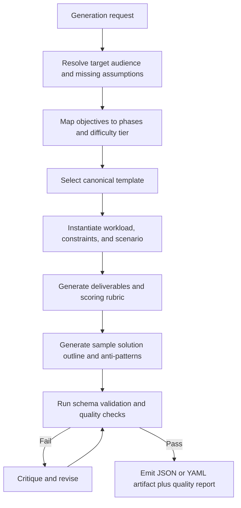
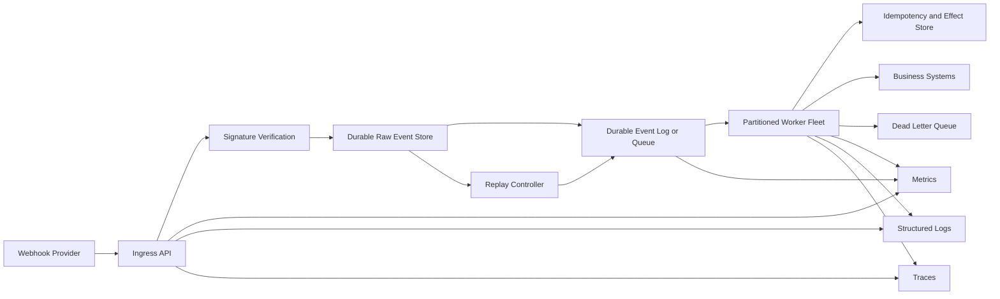
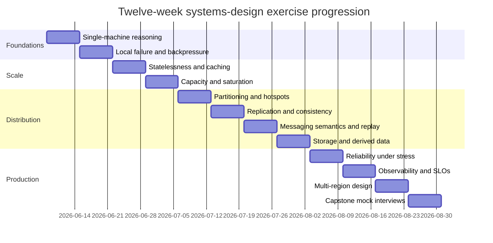

# Production-Ready Specification for Agent-Generated Language-Agnostic Systems-Design Exercises

## Executive summary

The best way ahead is **not** “give an agent a JSON schema and ask for interview problems.” The primary sources all point in a deeper direction. _Designing Data-Intensive Applications_ organizes the space around reliability, scalability, maintainability, storage, encoding, replication, partitioning, transactions, and distributed-system failure modes; PostgreSQL’s documentation turns concurrency, snapshot isolation, partitioning, and replication tradeoffs into concrete operational choices; Kafka’s documentation makes decoupling, partitioning, replication, ordering, retention, and delivery guarantees explicit; Raft grounds consensus in replicated logs and majority availability; CAP sources clarify that the meaningful tradeoff under partitions is between consistency and availability; and the cloud architecture frameworks elevate reliability targets, observability, graceful degradation, recovery, and postmortems to first-class design concerns. An exercise generator that does not encode those concerns will predictably degrade into surface-level component naming or “JSON munging.” citeturn18view0turn15view0turn15view1turn16view0turn17view0turn13view0turn19view0turn21view0turn22view1turn25view0turn22view2turn23view0turn23view2

A production-ready generator should therefore be **contract-driven** and **curriculum-aware**. The recommended architecture has four artifacts: a generation request contract, an exercise artifact contract, a rubric-and-solution contract, and a quality report. JSON Schema should be the normative validation layer because it is explicitly designed for annotating and validating structure, constraints, and data types, while YAML should be allowed as the human-authoring surface because YAML is designed as a human-friendly data-serialization language. citeturn24view0turn24view1turn24view2

The most important practical recommendation is to enforce **depth gates**. Every non-beginner exercise should require, at minimum, explicit workload assumptions, at least one failure mode, at least one consistency or partitioning decision, non-functional requirements, observable success criteria, and a rubric that rewards tradeoff reasoning rather than box-drawing. That recommendation is a synthesis of DDIA’s reliability/scalability framing, Raft’s fault-tolerance model, Kafka’s partition/ordering model, PostgreSQL’s concurrency and replication semantics, and the AWS/Google/Azure guidance on reliability targets, observability, and recovery. citeturn18view0turn19view0turn13view0turn15view0turn16view1turn17view0turn22view1turn25view0turn22view3turn23view0

The operational default should be: **objective-first generation, template-based instantiation, rubric-first scoring, and automated linting before emission**. That pattern gives you repeatability, makes language-agnostic output enforceable, and sharply reduces shallow exercises that only ask candidates to shuffle service names or sketch CRUD endpoints without performance, failure, or consistency pressure. citeturn22view1turn25view0turn23view0turn24view0turn24view1

| Decision area       | Recommended default                                                               |
| ------------------- | --------------------------------------------------------------------------------- |
| Normative format    | JSON Schema Draft 2020-12 for validation; YAML allowed for authoring              |
| Generator mode      | Curriculum-first, not prompt-only                                                 |
| Exercise depth gate | Capacity + failure + tradeoff + observability for all mid/senior problems         |
| Scoring model       | Rubric-first; measurable success criteria; weights sum to 100                     |
| Quality assurance   | Schema validation, ambiguity linting, language-agnosticness lint, coverage checks |
| Catalog strategy    | Maintain canonical templates, then generate constrained variants                  |

## Assumptions and design principles

The request explicitly asks that unspecified items stay configurable. The safest production assumption is therefore to make the generator **parameterized by audience and delivery mode**, rather than silently optimizing for a single interview style.

| Unspecified item                            | Recommended default assumption                                                           | Why this is the safest default                                      |
| ------------------------------------------- | ---------------------------------------------------------------------------------------- | ------------------------------------------------------------------- |
| Specific target audience for this generator | `unspecified` at request time; supported values are `beginner`, `mid`, `senior`, `mixed` | Prevents silent bias toward only interview-ready senior prompts     |
| Cohort size                                 | `null` or `unspecified`                                                                  | Works for self-study, pair practice, or classroom use               |
| Delivery platform                           | `markdown_yaml_json`                                                                     | Portable across docs, LMSs, repos, and agent pipelines              |
| Assessment mode                             | `self_study_or_mock_interview`                                                           | Supports both solo practice and interviewer-led rehearsal           |
| Cloud/provider specificity                  | `provider_neutral` by default                                                            | Preserves language and platform agnosticism                         |
| Solution detail level                       | `outline_not_full_solution` by default                                                   | Leaves room for learner reasoning while still supporting evaluation |

A production-ready exercise specification should reflect what the primary sources treat as first-order design concerns: explicit reliability goals, realistic load/performance framing, concurrency semantics, partitioning and replication strategy, graceful degradation, recovery testing, and observability. Google’s reliability pillar explicitly calls out scoping, observation, response, and learning; Azure’s guidance makes SLO, SLI, SLA, MTTR, MTBF, RTO, and RPO explicit; AWS frames architecture review around the pros and cons of decisions; Google SRE emphasizes the four golden signals; and OpenTelemetry standardizes telemetry as traces, metrics, and logs. That means the generator must produce artifacts that are evaluable against those concerns, not just descriptive. citeturn25view0turn22view3turn22view1turn23view0turn23view2

The design principles below are the ones most worth hard-coding into the agent:

| Principle                | Operational rule for the agent                                                        | Why it matters                                        |
| ------------------------ | ------------------------------------------------------------------------------------- | ----------------------------------------------------- |
| Objective-first          | Derive and emit learning objectives before writing the scenario                       | Prevents incoherent prompts                           |
| Depth over decoration    | Require NFRs, failure modes, and tradeoffs before diagrams                            | Blocks shallow “managed-service collage” outputs      |
| Technology neutrality    | Describe components, interfaces, invariants, and flows; avoid language/framework APIs | Preserves language agnosticism                        |
| Assumption discipline    | If the request omits key load or business data, record assumptions explicitly         | Reduces ambiguity and unfair grading                  |
| Rubric alignment         | Every learning objective must map to at least one scoring dimension                   | Makes grading defensible                              |
| Variant generation       | Separate canonical template from scenario instantiation                               | Improves diversity without losing control             |
| Recovery + observability | Require monitoring and failure response for all mid/senior exercises                  | Matches production reality                            |
| Anti-pattern coverage    | Include common wrong turns in every exercise artifact                                 | Improves usefulness for interview prep and reflection |

A useful anti-goal is worth stating plainly: **do not ask the agent to generate “a JSON problem”**. Ask it to generate **an exercise artifact that just happens to serialize as JSON or YAML**. That phrasing pushes the model toward system behavior, workload assumptions, invariants, and tradeoffs instead of schema shape alone. This recommendation is an inference from the way the primary sources describe real systems: as interacting components with explicit failure, ordering, isolation, and recovery properties. citeturn18view0turn15view0turn13view0turn19view0turn21view0turn25view0

## Learning architecture and progression

A strong generator should follow the conceptual order implied by DDIA’s progression from foundations to distributed data, then extend that progression with cloud reliability and SRE observability. That yields a curriculum that starts local, adds scale, then adds correctness and operations, and only then moves into large-scale system archetypes. citeturn18view0turn18view1turn25view0turn23view0

| Phase                       | Core concepts to teach                                                                              | What the exercise must force the learner to do                                                  | Source anchor                                                                                                                                                                         |
| --------------------------- | --------------------------------------------------------------------------------------------------- | ----------------------------------------------------------------------------------------------- | ------------------------------------------------------------------------------------------------------------------------------------------------------------------------------------- |
| Single-machine              | local bottlenecks, storage/index behavior, request lifecycle, concurrency control                   | Identify where state lives, where contention appears, and which local assumptions break first   | DDIA foundations and storage/query topics; PostgreSQL MVCC and snapshot semantics. citeturn18view0turn15view0                                                                     |
| Scalability                 | statelessness, decoupling, horizontal scaling, caching, load distribution                           | Explain how to remove single-node bottlenecks and what state must move out of process           | Google Cloud recommends decoupling and stateless architectures for reliability and scalability. citeturn22view0                                                                    |
| Partitioning                | range/hash/list partitioning, hotspotting, rebalancing, partition pruning                           | Choose a partition key, justify it, and analyze skew and maintenance behavior                   | DDIA partitioning; PostgreSQL declarative partitioning benefits and forms. citeturn18view0turn15view1                                                                             |
| Replication and consistency | leader/follower, async vs sync replication, quorum thinking, replicated logs, consensus, CAP        | State the consistency goal, explain failover behavior, and justify latency/durability tradeoffs | DDIA replication/consensus; Postgres logical and streaming replication; Raft majority progress; CAP clarification. citeturn18view0turn16view0turn17view0turn19view0turn21view0 |
| Messaging                   | publish/subscribe, partition ordering, retention, backpressure, consumer groups, delivery semantics | Define delivery semantics, ordering scope, replay behavior, and failure handling in pipelines   | Kafka intro and guarantees around partition order, retention, replication, and exactly-once processing capability. citeturn13view0                                                 |
| Storage                     | data models, OLTP vs analytics, indexes, retention, archival, batch/stream dataflow                 | Pick a storage pattern and justify read/write/retention tradeoffs                               | DDIA storage/retrieval and derived-data chapters; PostgreSQL partitioning and logical replication. citeturn18view0turn16view0turn15view1                                         |
| Reliability                 | SLO/SLI/SLA, redundancy, graceful degradation, failover, recovery, postmortems                      | Translate business needs into availability/recovery targets and fault-handling choices          | AWS Well-Architected, Google reliability pillar, Azure reliability metrics. citeturn22view1turn25view0turn22view3                                                                |
| Observability               | latency/traffic/errors/saturation, traces, metrics, logs, black-box vs white-box monitoring         | Define what to measure, alert on, and inspect during incidents                                  | Google SRE four golden signals; OpenTelemetry signals. citeturn23view0turn23view2                                                                                                 |
| Large-scale patterns        | composition of building blocks into feeds, chat, analytics, control planes, multi-region services   | Synthesize multiple earlier concepts into one architecture and justify the chosen patterns      | DDIA building blocks and stream/batch composition; cloud architecture frameworks. citeturn18view1turn18view2turn22view1turn25view0                                              |

The most reliable difficulty progression is a four-tier ladder:

| Difficulty tier | Best audience fit               | What changes from the previous tier                                                                   | Typical exercise time |
| --------------- | ------------------------------- | ----------------------------------------------------------------------------------------------------- | --------------------- |
| Foundation      | beginner                        | Local reasoning, single bottleneck, one main data structure or service boundary                       | 20–35 min             |
| Applied         | mid                             | Adds realistic workload, caching, horizontal scale, and basic NFRs                                    | 30–45 min             |
| Distributed     | strong mid / early senior       | Adds partitioning, replication, retries, idempotency, consistency decisions                           | 45–60 min             |
| Production      | senior / backend interview prep | Adds ambiguity management, multi-region failure, operability, observability, recovery, cost tradeoffs | 60–90 min             |

A simple but effective progression rule is: **each new tier should preserve the previous tier’s invariants and add one new stressor**. Typical stressors are load, partitions, stale reads, replay, cross-region latency, or incident response. This keeps exercises developmental rather than random.

## Exercise taxonomy and required metadata

The exercise catalog should deliberately mix exercise types because each type measures a different kind of systems-design competence. AWS’s own framework describes architecture review as a constructive conversation about decisions rather than an audit, which is a good model here: some exercises should test synthesis, others should probe precision, tradeoffs, recovery reasoning, or communication under time pressure. citeturn22view1

| Exercise type                                | Best use                                        | What the learner must produce                                                                | Most common failure mode                                 |
| -------------------------------------------- | ----------------------------------------------- | -------------------------------------------------------------------------------------------- | -------------------------------------------------------- |
| Open-ended design                            | End-to-end system synthesis                     | Architecture, assumptions, APIs/data flow, storage, scaling, failure handling, observability | Overly broad answers with no tradeoff depth              |
| Focused component design                     | Deep reasoning about one subsystem              | Internal component design, invariants, edge cases, interfaces                                | Learner ignores surrounding system constraints           |
| Tradeoff analysis                            | Consistency/latency/cost reasoning              | Comparison matrix, recommendation, rejected alternatives                                     | Hand-wavy pros/cons with no workload anchor              |
| Whiteboard sketch                            | Interview communication and prioritization      | Fast component graph, read/write paths, bottlenecks, next steps                              | Pretty sketch, weak substance                            |
| Implementation-agnostic architecture diagram | Communication of system shape without code bias | Labeled components, stores, queues, boundaries, failure domains                              | Diagram lacks behavior or ownership                      |
| Fault-injection scenario                     | Reliability and recovery reasoning              | Failure analysis, blast radius, detection, mitigation, runbook                               | Learner proposes retries without understanding causality |
| Capacity-planning problem                    | Quantitative reasoning                          | Back-of-the-envelope math, bottleneck forecast, margin assumptions                           | Arithmetic without architecture consequences             |
| Time-boxed mock interview                    | Senior/backend prep and fluency                 | Prioritized design narrative plus clarifying assumptions                                     | Learner spends all time on one subsystem                 |

The required metadata should be rich enough to support generation, grading, mutation, and replay. The table below is the minimum field set I would treat as production-ready.

| Field                         | Type          | Required | Validation rule                                                                                                     | Purpose                                |
| ----------------------------- | ------------- | -------: | ------------------------------------------------------------------------------------------------------------------- | -------------------------------------- | ----------- | ----------- | -------------------------- | --------------------------- |
| `title`                       | string        |      Yes | 8–120 chars                                                                                                         | Human-readable identifier              |
| `description`                 | string        |      Yes | 80–1200 chars                                                                                                       | Scenario and problem statement         |
| `target_audience`             | enum          |      Yes | `beginner                                                                                                           | mid                                    | senior      | mixed       | unspecified`               | Controls phrasing and depth |
| `learning_objectives`         | array<object> |      Yes | 1–6 objectives; each has `phase`, `verb`, `statement`                                                               | Aligns exercise to curriculum          |
| `prerequisites`               | array<string> |      Yes | 0–12 items                                                                                                          | Prevents incoherent tier jumps         |
| `difficulty_tier`             | enum          |      Yes | `foundation                                                                                                         | applied                                | distributed | production` | Primary difficulty control |
| `estimated_time_minutes`      | integer       |      Yes | 10–180                                                                                                              | Scheduling and mock interview fit      |
| `exercise_type`               | enum          |      Yes | One of the eight allowed types                                                                                      | Shapes deliverables and scoring        |
| `phases`                      | array<enum>   |      Yes | 1–4 phases; unique                                                                                                  | Keeps scope intentional                |
| `input_constraints`           | object        |      Yes | Mid+ should include at least load or data-size constraint                                                           | Defines the givens                     |
| `output_constraints`          | object        |      Yes | Must specify expected deliverables                                                                                  | Defines what a learner should return   |
| `functional_requirements`     | array<string> |      Yes | 2–12 items                                                                                                          | Captures system behavior               |
| `non_functional_requirements` | object        |      Yes | Mid+ must include at least three of latency, throughput, availability, durability, consistency, retention, security | Forces realistic design pressure       |
| `success_criteria`            | array<object> |      Yes | 2–8 measurable criteria                                                                                             | Makes grading objective                |
| `rubric`                      | object        |      Yes | Weights sum to 100                                                                                                  | Evaluation contract                    |
| `hints`                       | array<object> |      Yes | 0–3 levels; no full-solution leakage before highest level                                                           | Progressive scaffolding                |
| `sample_solution_outline`     | object        |      Yes | Must include assumptions, architecture, tradeoffs, failure handling, observability                                  | Supports review and self-study         |
| `anti_patterns`               | array<string> |      Yes | 3–10 items                                                                                                          | Teaches common mistakes                |
| `test_cases`                  | array<object> |      Yes | At least 2; mid+ must include one failure or edge case                                                              | Probe set for evaluation               |
| `scoring_weights`             | object        |      Yes | Keys must match rubric dimensions; sum to 100                                                                       | Machine-checkable score composition    |
| `quality_report`              | object        |      Yes | Contains lint/eval results                                                                                          | Allows automated rejection or revision |

The non-functional fields above are not ornamental. Reliability targets, recoverability, and observability are the difference between a toy prompt and a production-style design problem, and the cloud frameworks explicitly treat those as core to architecture quality. citeturn22view3turn25view0turn22view2turn23view0

## Agent contract and schemas

The cleanest implementation is to use **JSON Schema as the normative contract** and allow **YAML as an isomorphic authoring format**. JSON Schema exists specifically to validate structure, constraints, and data types, and YAML is explicitly defined as a human-friendly serialization language. citeturn24view0turn24view1turn24view2



The following schema is the recommended **agent input contract**.

```json
{
  "$schema": "https://json-schema.org/draft/2020-12/schema",
  "$id": "https://example.org/schemas/exercise-generation-request.json",
  "title": "ExerciseGenerationRequest",
  "type": "object",
  "additionalProperties": false,
  "required": [
    "schema_version",
    "language_scope",
    "target_audience",
    "learning_phase_focus",
    "requested_exercise_types",
    "difficulty_tier",
    "count",
    "quality_gates"
  ],
  "properties": {
    "schema_version": {
      "type": "string",
      "const": "1.0"
    },
    "language_scope": {
      "type": "string",
      "const": "agnostic"
    },
    "target_audience": {
      "type": "string",
      "enum": ["beginner", "mid", "senior", "mixed", "unspecified"]
    },
    "learning_phase_focus": {
      "type": "array",
      "items": {
        "type": "string",
        "enum": [
          "single_machine",
          "scalability",
          "partitioning",
          "replication_consistency",
          "messaging",
          "storage",
          "reliability",
          "observability",
          "large_scale_patterns"
        ]
      },
      "minItems": 1,
      "uniqueItems": true
    },
    "concept_focus": {
      "type": "array",
      "items": { "type": "string", "minLength": 2 },
      "minItems": 1,
      "uniqueItems": true
    },
    "requested_exercise_types": {
      "type": "array",
      "items": {
        "type": "string",
        "enum": [
          "open_ended_design",
          "focused_component_design",
          "tradeoff_analysis",
          "whiteboard_sketch",
          "implementation_agnostic_architecture_diagram",
          "fault_injection",
          "capacity_planning",
          "time_boxed_mock_interview"
        ]
      },
      "minItems": 1,
      "uniqueItems": true
    },
    "difficulty_tier": {
      "type": "string",
      "enum": ["foundation", "applied", "distributed", "production"]
    },
    "count": {
      "type": "integer",
      "minimum": 1,
      "maximum": 20
    },
    "time_box_minutes": {
      "type": "integer",
      "minimum": 10,
      "maximum": 180
    },
    "cohort_context": {
      "type": "object",
      "additionalProperties": false,
      "properties": {
        "cohort_size": {
          "type": ["integer", "null"],
          "minimum": 1,
          "maximum": 500
        },
        "delivery_platform": {
          "type": "string",
          "enum": [
            "self_study",
            "mock_interview",
            "classroom",
            "bootcamp",
            "lms",
            "repository",
            "unspecified"
          ]
        },
        "prior_topics": {
          "type": "array",
          "items": { "type": "string", "minLength": 2 },
          "uniqueItems": true
        }
      }
    },
    "constraints": {
      "type": "object",
      "additionalProperties": false,
      "properties": {
        "users": { "type": "integer", "minimum": 1 },
        "peak_rps": { "type": "integer", "minimum": 1 },
        "read_write_ratio": {
          "type": "string",
          "pattern": "^\\d+:\\d+$"
        },
        "regions": { "type": "integer", "minimum": 1, "maximum": 20 },
        "availability_slo": {
          "type": "string",
          "pattern": "^\\d{2,3}(\\.\\d+)?%$"
        },
        "p95_latency_ms": { "type": "integer", "minimum": 1 },
        "data_retention_days": { "type": "integer", "minimum": 1 },
        "consistency_preference": {
          "type": "string",
          "enum": [
            "strong",
            "read_your_writes",
            "causal",
            "eventual",
            "mixed",
            "unspecified"
          ]
        }
      }
    },
    "curriculum_state": {
      "type": "object",
      "additionalProperties": false,
      "properties": {
        "covered_objectives": {
          "type": "array",
          "items": { "type": "string", "minLength": 2 },
          "uniqueItems": true
        },
        "avoid_duplicate_templates": { "type": "boolean" }
      }
    },
    "quality_gates": {
      "type": "object",
      "additionalProperties": false,
      "required": [
        "require_failure_mode",
        "require_tradeoff_matrix",
        "require_observability",
        "require_capacity_math",
        "forbid_language_specific_terms"
      ],
      "properties": {
        "require_failure_mode": { "type": "boolean" },
        "require_tradeoff_matrix": { "type": "boolean" },
        "require_observability": { "type": "boolean" },
        "require_capacity_math": { "type": "boolean" },
        "require_sample_solution": { "type": "boolean" },
        "forbid_language_specific_terms": { "type": "boolean" },
        "max_ambiguity_markers": {
          "type": "integer",
          "minimum": 0,
          "maximum": 10
        }
      }
    }
  }
}
```

The following schema is the recommended **agent output contract**.

```json
{
  "$schema": "https://json-schema.org/draft/2020-12/schema",
  "$id": "https://example.org/schemas/exercise-artifact.json",
  "title": "ExerciseArtifact",
  "type": "object",
  "additionalProperties": false,
  "required": [
    "schema_version",
    "exercise_id",
    "title",
    "description",
    "target_audience",
    "difficulty_tier",
    "exercise_type",
    "estimated_time_minutes",
    "phases",
    "learning_objectives",
    "prerequisites",
    "functional_requirements",
    "input_constraints",
    "output_constraints",
    "non_functional_requirements",
    "success_criteria",
    "rubric",
    "hints",
    "sample_solution_outline",
    "anti_patterns",
    "test_cases",
    "scoring_weights",
    "quality_report"
  ],
  "properties": {
    "schema_version": {
      "type": "string",
      "const": "1.0"
    },
    "exercise_id": {
      "type": "string",
      "pattern": "^ex_[a-z0-9_]{6,80}$"
    },
    "title": {
      "type": "string",
      "minLength": 8,
      "maxLength": 120
    },
    "description": {
      "type": "string",
      "minLength": 80,
      "maxLength": 4000
    },
    "target_audience": {
      "type": "string",
      "enum": ["beginner", "mid", "senior", "mixed", "unspecified"]
    },
    "difficulty_tier": {
      "type": "string",
      "enum": ["foundation", "applied", "distributed", "production"]
    },
    "exercise_type": {
      "type": "string",
      "enum": [
        "open_ended_design",
        "focused_component_design",
        "tradeoff_analysis",
        "whiteboard_sketch",
        "implementation_agnostic_architecture_diagram",
        "fault_injection",
        "capacity_planning",
        "time_boxed_mock_interview"
      ]
    },
    "estimated_time_minutes": {
      "type": "integer",
      "minimum": 10,
      "maximum": 180
    },
    "phases": {
      "type": "array",
      "items": {
        "type": "string",
        "enum": [
          "single_machine",
          "scalability",
          "partitioning",
          "replication_consistency",
          "messaging",
          "storage",
          "reliability",
          "observability",
          "large_scale_patterns"
        ]
      },
      "minItems": 1,
      "maxItems": 4,
      "uniqueItems": true
    },
    "learning_objectives": {
      "type": "array",
      "minItems": 1,
      "maxItems": 6,
      "items": {
        "type": "object",
        "additionalProperties": false,
        "required": ["id", "phase", "verb", "statement"],
        "properties": {
          "id": {
            "type": "string",
            "pattern": "^lo_[a-z0-9_]{3,40}$"
          },
          "phase": {
            "type": "string",
            "enum": [
              "single_machine",
              "scalability",
              "partitioning",
              "replication_consistency",
              "messaging",
              "storage",
              "reliability",
              "observability",
              "large_scale_patterns"
            ]
          },
          "verb": {
            "type": "string",
            "enum": [
              "identify",
              "explain",
              "estimate",
              "design",
              "compare",
              "justify",
              "evaluate"
            ]
          },
          "statement": {
            "type": "string",
            "minLength": 12,
            "maxLength": 240
          }
        }
      }
    },
    "prerequisites": {
      "type": "array",
      "items": { "type": "string", "minLength": 2 },
      "uniqueItems": true
    },
    "functional_requirements": {
      "type": "array",
      "minItems": 2,
      "maxItems": 12,
      "items": { "type": "string", "minLength": 8 }
    },
    "input_constraints": {
      "type": "object",
      "additionalProperties": false,
      "properties": {
        "users": { "type": "integer", "minimum": 1 },
        "peak_rps": { "type": "integer", "minimum": 1 },
        "regions": { "type": "integer", "minimum": 1, "maximum": 20 },
        "payload_kb": { "type": "number", "exclusiveMinimum": 0 },
        "working_set_gb": { "type": "number", "exclusiveMinimum": 0 },
        "retention_days": { "type": "integer", "minimum": 1 },
        "read_write_ratio": {
          "type": "string",
          "pattern": "^\\d+:\\d+$"
        }
      }
    },
    "output_constraints": {
      "type": "object",
      "additionalProperties": false,
      "required": ["required_deliverables"],
      "properties": {
        "required_deliverables": {
          "type": "array",
          "minItems": 1,
          "items": {
            "type": "string",
            "enum": [
              "architecture_diagram",
              "data_model",
              "api_contract",
              "read_write_path",
              "capacity_plan",
              "tradeoff_matrix",
              "failure_analysis",
              "observability_plan",
              "runbook",
              "sequence_diagram"
            ]
          },
          "uniqueItems": true
        },
        "forbidden_content": {
          "type": "array",
          "items": { "type": "string", "minLength": 2 },
          "uniqueItems": true
        }
      }
    },
    "non_functional_requirements": {
      "type": "object",
      "additionalProperties": false,
      "properties": {
        "availability_slo": {
          "type": "string",
          "pattern": "^\\d{2,3}(\\.\\d+)?%$"
        },
        "p95_latency_ms": { "type": "integer", "minimum": 1 },
        "p99_latency_ms": { "type": "integer", "minimum": 1 },
        "throughput_rps": { "type": "integer", "minimum": 1 },
        "durability": {
          "type": "string",
          "enum": [
            "best_effort",
            "single_az",
            "multi_az",
            "multi_region",
            "custom"
          ]
        },
        "consistency_model": {
          "type": "string",
          "enum": [
            "strong",
            "read_your_writes",
            "causal",
            "eventual",
            "per_partition_ordering",
            "mixed"
          ]
        },
        "rto_minutes": { "type": "integer", "minimum": 0 },
        "rpo_minutes": { "type": "integer", "minimum": 0 },
        "security_note": {
          "type": "string",
          "minLength": 4,
          "maxLength": 400
        },
        "observability_note": {
          "type": "string",
          "minLength": 4,
          "maxLength": 400
        }
      }
    },
    "success_criteria": {
      "type": "array",
      "minItems": 2,
      "maxItems": 8,
      "items": {
        "type": "object",
        "additionalProperties": false,
        "required": ["criterion", "weight"],
        "properties": {
          "criterion": { "type": "string", "minLength": 8, "maxLength": 240 },
          "weight": { "type": "integer", "minimum": 1, "maximum": 100 }
        }
      }
    },
    "rubric": {
      "type": "object",
      "additionalProperties": false,
      "required": ["dimensions", "pass_score"],
      "properties": {
        "dimensions": {
          "type": "array",
          "minItems": 2,
          "maxItems": 10,
          "items": {
            "type": "object",
            "additionalProperties": false,
            "required": ["name", "description", "weight"],
            "properties": {
              "name": { "type": "string", "minLength": 3, "maxLength": 80 },
              "description": {
                "type": "string",
                "minLength": 8,
                "maxLength": 300
              },
              "weight": { "type": "integer", "minimum": 1, "maximum": 100 }
            }
          }
        },
        "pass_score": { "type": "integer", "minimum": 1, "maximum": 100 }
      }
    },
    "hints": {
      "type": "array",
      "maxItems": 3,
      "items": {
        "type": "object",
        "additionalProperties": false,
        "required": ["level", "text"],
        "properties": {
          "level": { "type": "integer", "minimum": 1, "maximum": 3 },
          "text": { "type": "string", "minLength": 8, "maxLength": 300 }
        }
      }
    },
    "sample_solution_outline": {
      "type": "object",
      "additionalProperties": false,
      "required": [
        "assumptions",
        "architecture_summary",
        "key_components",
        "critical_tradeoffs",
        "failure_handling",
        "observability"
      ],
      "properties": {
        "assumptions": {
          "type": "array",
          "items": { "type": "string", "minLength": 4 }
        },
        "architecture_summary": {
          "type": "string",
          "minLength": 20,
          "maxLength": 1200
        },
        "key_components": {
          "type": "array",
          "items": { "type": "string", "minLength": 3 }
        },
        "critical_tradeoffs": {
          "type": "array",
          "items": { "type": "string", "minLength": 8 }
        },
        "failure_handling": {
          "type": "array",
          "items": { "type": "string", "minLength": 8 }
        },
        "observability": {
          "type": "array",
          "items": { "type": "string", "minLength": 8 }
        }
      }
    },
    "anti_patterns": {
      "type": "array",
      "minItems": 3,
      "maxItems": 10,
      "items": { "type": "string", "minLength": 8 }
    },
    "test_cases": {
      "type": "array",
      "minItems": 2,
      "maxItems": 10,
      "items": {
        "type": "object",
        "additionalProperties": false,
        "required": ["id", "type", "prompt"],
        "properties": {
          "id": { "type": "string", "pattern": "^tc_[a-z0-9_]{3,40}$" },
          "type": {
            "type": "string",
            "enum": [
              "happy_path",
              "edge_case",
              "failure_injection",
              "capacity",
              "consistency",
              "operability"
            ]
          },
          "prompt": { "type": "string", "minLength": 12, "maxLength": 320 }
        }
      }
    },
    "scoring_weights": {
      "type": "object",
      "additionalProperties": {
        "type": "integer",
        "minimum": 1,
        "maximum": 100
      },
      "minProperties": 2
    },
    "quality_report": {
      "type": "object",
      "additionalProperties": false,
      "required": [
        "schema_valid",
        "objective_coverage_score",
        "ambiguity_count",
        "language_agnosticness_score",
        "surface_level_risk"
      ],
      "properties": {
        "schema_valid": { "type": "boolean" },
        "objective_coverage_score": {
          "type": "number",
          "minimum": 0,
          "maximum": 1
        },
        "ambiguity_count": { "type": "integer", "minimum": 0 },
        "language_agnosticness_score": {
          "type": "number",
          "minimum": 0,
          "maximum": 1
        },
        "surface_level_risk": {
          "type": "string",
          "enum": ["low", "medium", "high"]
        }
      }
    }
  }
}
```

Some of the most valuable validation rules are easier to express as **quality gates** than as pure schema logic:

| Conditional rule                                      | Recommended enforcement                                                                                                |
| ----------------------------------------------------- | ---------------------------------------------------------------------------------------------------------------------- |
| If `difficulty_tier` is `distributed` or `production` | Require at least one failure mode, one tradeoff matrix, one observability note, and one capacity or latency constraint |
| If `exercise_type` is `capacity_planning`             | Require a `capacity_plan` deliverable and at least one numeric bottleneck constraint                                   |
| If `exercise_type` is `fault_injection`               | Require at least one `failure_injection` test case                                                                     |
| If `exercise_type` is `time_boxed_mock_interview`     | Require prioritized deliverables and `estimated_time_minutes <= 90`                                                    |
| If `language_scope` is `agnostic`                     | Forbid language/framework/service tokens unless explicitly allowed in `forbidden_content` exceptions                   |
| If `target_audience` is `beginner`                    | Limit phases to 1–2 and avoid multi-region plus consensus in the same prompt                                           |
| For all exercises                                     | Rubric weights and scoring weights must sum to 100; every learning objective must map to a rubric dimension            |

A compact YAML example of a **generation request**:

```yaml
schema_version: "1.0"
language_scope: agnostic
target_audience: senior
learning_phase_focus:
  - messaging
  - reliability
  - observability
  - replication_consistency
concept_focus:
  - idempotency
  - backpressure
  - replay
  - delivery semantics
requested_exercise_types:
  - open_ended_design
difficulty_tier: production
count: 1
time_box_minutes: 60
cohort_context:
  cohort_size: null
  delivery_platform: mock_interview
  prior_topics:
    - partitioning
    - caching
    - read replicas
constraints:
  users: 2000000
  peak_rps: 50000
  regions: 2
  availability_slo: "99.95%"
  p95_latency_ms: 250
  data_retention_days: 30
  consistency_preference: mixed
quality_gates:
  require_failure_mode: true
  require_tradeoff_matrix: true
  require_observability: true
  require_capacity_math: true
  require_sample_solution: true
  forbid_language_specific_terms: true
  max_ambiguity_markers: 2
```

A compact YAML example of an **exercise artifact**:

```yaml
schema_version: "1.0"
exercise_id: ex_payment_webhook_ingestion
title: Design a resilient payment webhook ingestion pipeline
target_audience: senior
difficulty_tier: production
exercise_type: open_ended_design
estimated_time_minutes: 60
phases:
  - messaging
  - reliability
  - observability
learning_objectives:
  - id: lo_define_delivery
    phase: messaging
    verb: justify
    statement: Justify delivery semantics and replay strategy for inbound webhooks
prerequisites:
  - queues and pub/sub
  - retry semantics
  - idempotency basics
functional_requirements:
  - Accept signed third-party webhooks
  - Deduplicate repeated deliveries
  - Process events asynchronously
input_constraints:
  peak_rps: 50000
  regions: 2
  retention_days: 30
output_constraints:
  required_deliverables:
    - architecture_diagram
    - tradeoff_matrix
    - failure_analysis
    - observability_plan
non_functional_requirements:
  availability_slo: "99.95%"
  p95_latency_ms: 250
  consistency_model: mixed
  rto_minutes: 15
  rpo_minutes: 5
success_criteria:
  - criterion: Explicitly defines idempotency boundary
    weight: 20
rubric:
  dimensions:
    - name: Semantics
      description: Delivery, deduplication, replay
      weight: 30
    - name: Reliability
      description: Failure handling and recovery
      weight: 40
    - name: Observability
      description: Metrics, logs, traces, alerts
      weight: 30
  pass_score: 70
hints:
  - level: 1
    text: Start by deciding what must happen before acknowledging receipt
sample_solution_outline:
  assumptions:
    - Provider delivers at least once and sometimes out of order
  architecture_summary: Persist before acknowledging, then process asynchronously with idempotent consumers
  key_components:
    - ingress api
    - signature verifier
    - durable queue
    - idempotency store
    - worker fleet
  critical_tradeoffs:
    - ack latency versus durability
  failure_handling:
    - dlq and replay
  observability:
    - enqueue latency
anti_patterns:
  - Acknowledge before durable persistence
test_cases:
  - id: tc_duplicate_delivery
    type: edge_case
    prompt: Same provider event arrives three times
scoring_weights:
  Semantics: 30
  Reliability: 40
  Observability: 30
quality_report:
  schema_valid: true
  objective_coverage_score: 1.0
  ambiguity_count: 1
  language_agnosticness_score: 1.0
  surface_level_risk: low
```

## Canonical templates and worked example

The strongest catalog strategy is to maintain a **small canonical library** that spans phases and difficulties, then generate many constrained variants from those seeds. That aligns better with the source material than free-form prompting, because the core concepts recur across systems: concurrency, partitioning, replication, ordering, durability, availability, recovery, and observability. citeturn18view0turn13view0turn15view0turn25view0turn23view0

```yaml
canonical_templates:
  - id: ex_local_cache_eviction
    title: Single-node cache eviction under mixed read/write load
    exercise_type: focused_component_design
    difficulty_tier: foundation
    target_audience: beginner
    phases: [single_machine, scalability]
    concepts: [memory_pressure, eviction_policy, hit_rate, local_state]
    default_time_minutes: 25
    required_deliverables: [read_write_path, tradeoff_matrix]
    depth_gate: explain contention and memory behavior

  - id: ex_index_design_query_plan
    title: Database index design for a read-heavy query workload
    exercise_type: focused_component_design
    difficulty_tier: foundation
    target_audience: beginner
    phases: [single_machine, storage]
    concepts: [indexes, query_patterns, write_amplification, hot_paths]
    default_time_minutes: 30
    required_deliverables: [data_model, tradeoff_matrix]
    depth_gate: justify index choice against writes

  - id: ex_local_job_queue_backpressure
    title: Single-machine background job queue with backpressure
    exercise_type: fault_injection
    difficulty_tier: foundation
    target_audience: beginner
    phases: [single_machine, reliability]
    concepts: [queue_depth, retries, poison_jobs, local_failures]
    default_time_minutes: 30
    required_deliverables: [failure_analysis, observability_plan]
    depth_gate: define overload behavior

  - id: ex_stateless_session_service
    title: Refactor a stateful web service into a stateless service
    exercise_type: implementation_agnostic_architecture_diagram
    difficulty_tier: applied
    target_audience: mid
    phases: [scalability, reliability]
    concepts: [statelessness, session_storage, horizontal_scaling]
    default_time_minutes: 35
    required_deliverables: [architecture_diagram, tradeoff_matrix]
    depth_gate: separate compute from state

  - id: ex_edge_cache_strategy
    title: CDN and edge caching strategy for a global content service
    exercise_type: tradeoff_analysis
    difficulty_tier: applied
    target_audience: mid
    phases: [scalability, reliability]
    concepts: [cache_invalidation, ttl, regional_latency, origin_protection]
    default_time_minutes: 35
    required_deliverables: [tradeoff_matrix, observability_plan]
    depth_gate: define invalidation model

  - id: ex_load_balancing_capacity
    title: Load balancing and autoscaling for bursty traffic
    exercise_type: capacity_planning
    difficulty_tier: applied
    target_audience: mid
    phases: [scalability, reliability]
    concepts: [burst_capacity, autoscaling, saturation, headroom]
    default_time_minutes: 40
    required_deliverables: [capacity_plan, observability_plan]
    depth_gate: show margin assumptions

  - id: ex_partition_key_selection
    title: Partition-key selection for a multi-tenant event platform
    exercise_type: tradeoff_analysis
    difficulty_tier: applied
    target_audience: mid
    phases: [partitioning, messaging]
    concepts: [tenant_isolation, hotspotting, skew, rebalance]
    default_time_minutes: 40
    required_deliverables: [tradeoff_matrix, failure_analysis]
    depth_gate: analyze skew and migration cost

  - id: ex_distributed_cache_hashing
    title: Consistent hashing for a distributed cache cluster
    exercise_type: focused_component_design
    difficulty_tier: applied
    target_audience: mid
    phases: [partitioning, scalability]
    concepts: [consistent_hashing, membership_change, rebalance]
    default_time_minutes: 35
    required_deliverables: [architecture_diagram, tradeoff_matrix]
    depth_gate: compare rebalancing strategies

  - id: ex_read_replica_staleness
    title: Read replicas and stale-read mitigation
    exercise_type: fault_injection
    difficulty_tier: distributed
    target_audience: mid
    phases: [replication_consistency, reliability]
    concepts: [replication_lag, read_your_writes, failover]
    default_time_minutes: 45
    required_deliverables: [failure_analysis, tradeoff_matrix]
    depth_gate: define acceptable staleness

  - id: ex_config_service_coordination
    title: Coordination model for a replicated configuration service
    exercise_type: whiteboard_sketch
    difficulty_tier: distributed
    target_audience: mid
    phases: [replication_consistency, reliability]
    concepts: [consensus, leader_election, majority_quorum]
    default_time_minutes: 45
    required_deliverables: [architecture_diagram, failure_analysis]
    depth_gate: explain quorum behavior

  - id: ex_webhook_ingestion
    title: Idempotent webhook ingestion and processing pipeline
    exercise_type: open_ended_design
    difficulty_tier: distributed
    target_audience: mid
    phases: [messaging, reliability, observability]
    concepts: [idempotency, replay, retries, dlq, signatures]
    default_time_minutes: 50
    required_deliverables:
      [architecture_diagram, failure_analysis, observability_plan]
    depth_gate: define ack boundary and dedupe boundary

  - id: ex_consumer_group_scaling
    title: Scaling consumer groups for ordered event processing
    exercise_type: capacity_planning
    difficulty_tier: distributed
    target_audience: mid
    phases: [messaging, partitioning]
    concepts: [consumer_parallelism, partition_ordering, lag, backpressure]
    default_time_minutes: 45
    required_deliverables: [capacity_plan, tradeoff_matrix]
    depth_gate: preserve ordering scope

  - id: ex_metrics_store
    title: Real-time metrics ingestion and query system
    exercise_type: open_ended_design
    difficulty_tier: distributed
    target_audience: mid
    phases: [messaging, storage, observability]
    concepts: [high_cardinality, time_series_storage, rollups, retention]
    default_time_minutes: 55
    required_deliverables:
      [architecture_diagram, capacity_plan, observability_plan]
    depth_gate: justify compression and retention

  - id: ex_cdc_pipeline
    title: CDC pipeline from OLTP to analytics
    exercise_type: tradeoff_analysis
    difficulty_tier: distributed
    target_audience: mid
    phases: [storage, messaging, replication_consistency]
    concepts: [cdc, replay, ordering, schema_evolution, lag]
    default_time_minutes: 50
    required_deliverables: [architecture_diagram, tradeoff_matrix]
    depth_gate: discuss ordering and schema evolution

  - id: ex_global_rate_limiter
    title: Global rate limiter for a public API platform
    exercise_type: whiteboard_sketch
    difficulty_tier: production
    target_audience: senior
    phases: [partitioning, replication_consistency, reliability]
    concepts: [token_bucket, global_quota, hot_keys, fairness]
    default_time_minutes: 50
    required_deliverables:
      [architecture_diagram, tradeoff_matrix, failure_analysis]
    depth_gate: define where strictness is required

  - id: ex_retry_circuit_breaker
    title: Retry, timeout, and circuit-breaker strategy for a fan-out service
    exercise_type: fault_injection
    difficulty_tier: production
    target_audience: senior
    phases: [reliability, observability]
    concepts: [retry_storms, cascading_failure, graceful_degradation, alerts]
    default_time_minutes: 40
    required_deliverables: [failure_analysis, runbook, observability_plan]
    depth_gate: quantify retry amplification

  - id: ex_observability_platform
    title: Observability strategy for a microservice platform
    exercise_type: implementation_agnostic_architecture_diagram
    difficulty_tier: production
    target_audience: senior
    phases: [observability, reliability]
    concepts: [traces, metrics, logs, slos, alerting, sampling]
    default_time_minutes: 45
    required_deliverables: [architecture_diagram, observability_plan]
    depth_gate: define signal ownership and alert targets

  - id: ex_multi_region_metadata
    title: Multi-region file metadata service
    exercise_type: time_boxed_mock_interview
    difficulty_tier: production
    target_audience: senior
    phases: [partitioning, replication_consistency, reliability, observability]
    concepts: [metadata_consistency, failover, quorum, region_outage]
    default_time_minutes: 60
    required_deliverables:
      [
        architecture_diagram,
        tradeoff_matrix,
        failure_analysis,
        observability_plan,
      ]
    depth_gate: make region-failure behavior explicit

  - id: ex_news_feed_tradeoffs
    title: News feed fanout-on-write versus fanout-on-read
    exercise_type: time_boxed_mock_interview
    difficulty_tier: production
    target_audience: senior
    phases: [large_scale_patterns, storage, messaging]
    concepts: [fanout, celebrity_problem, cache_warmth, ranking]
    default_time_minutes: 60
    required_deliverables:
      [tradeoff_matrix, architecture_diagram, capacity_plan]
    depth_gate: model skew and hot publishers

  - id: ex_chat_presence_delivery
    title: Chat messaging, presence, and delivery guarantees
    exercise_type: open_ended_design
    difficulty_tier: production
    target_audience: senior
    phases:
      [large_scale_patterns, messaging, replication_consistency, observability]
    concepts:
      [presence, ordering, offline_delivery, unread_state, regional_failover]
    default_time_minutes: 70
    required_deliverables:
      [
        architecture_diagram,
        tradeoff_matrix,
        failure_analysis,
        observability_plan,
      ]
    depth_gate: define ordering and presence consistency scope
```

The fully fleshed example below shows the level of detail the agent should produce when asked for one serious, production-style problem.

```yaml
schema_version: "1.0"
exercise_id: ex_webhook_ingestion_pipeline
title: Design a resilient webhook ingestion and processing pipeline
target_audience: senior
difficulty_tier: production
exercise_type: open_ended_design
estimated_time_minutes: 60
phases:
  - messaging
  - replication_consistency
  - reliability
  - observability

description: >
  A payment provider sends webhook events to your platform whenever charges,
  refunds, disputes, and payout changes occur. The provider can deliver events
  at least once, sometimes out of order, and may retry for up to 72 hours. Your
  task is to design a language-agnostic system that ingests those webhooks,
  verifies authenticity, deduplicates repeated deliveries, stores raw events for
  replay, processes business actions asynchronously, and exposes enough
  observability to diagnose lag, duplication, and downstream failure.

prerequisites:
  - queues or logs
  - idempotency
  - retries and backoff
  - basic replication and failover
  - metrics, logs, and traces

learning_objectives:
  - id: lo_ack_boundary
    phase: messaging
    verb: justify
    statement: Decide what must happen before the ingress tier acknowledges receipt
  - id: lo_dedupe_boundary
    phase: replication_consistency
    verb: design
    statement: Define the deduplication and idempotency boundary for externally visible effects
  - id: lo_failure_recovery
    phase: reliability
    verb: evaluate
    statement: Explain replay, dead-letter, and downstream-failure recovery paths
  - id: lo_telemetry
    phase: observability
    verb: design
    statement: Specify the minimal telemetry needed to detect lag, duplicates, saturation, and silent data loss

functional_requirements:
  - Accept HTTPS webhook requests from one provider today, but allow more providers later
  - Verify request authenticity before processing
  - Persist raw webhook payloads for replay for 30 days
  - Deduplicate repeated deliveries
  - Support asynchronous business processing for charge.succeeded, refund.created, and dispute.opened
  - Allow operators to replay a bounded time range or a specific provider event ID
  - Prevent duplicate externally visible side effects during replays and retries

input_constraints:
  users: 3000000
  peak_rps: 50000
  regions: 2
  payload_kb: 8
  retention_days: 30
  read_write_ratio: "1:5"

output_constraints:
  required_deliverables:
    - architecture_diagram
    - read_write_path
    - capacity_plan
    - tradeoff_matrix
    - failure_analysis
    - observability_plan
    - runbook
  forbidden_content:
    - language-specific code
    - framework-specific APIs
    - cloud-provider lock-in unless explicitly justified as optional

non_functional_requirements:
  availability_slo: "99.95%"
  p95_latency_ms: 250
  throughput_rps: 50000
  durability: multi_az
  consistency_model: mixed
  rto_minutes: 15
  rpo_minutes: 5
  security_note: Verify signatures, redact secrets from telemetry, and restrict replay operations
  observability_note: Detect duplicates, queue lag, failed signatures, worker saturation, and replay skew

success_criteria:
  - criterion: The design states a clear acknowledgment boundary and justifies it
    weight: 15
  - criterion: The design distinguishes transport-level deduplication from business-level idempotency
    weight: 15
  - criterion: The design explains ordering scope and how out-of-order events are tolerated
    weight: 10
  - criterion: The design gives a replay and dead-letter workflow with operator controls
    weight: 15
  - criterion: The design includes a numerically defensible ingest and worker-capacity estimate
    weight: 10
  - criterion: The design defines a telemetry set that would catch silent failures and lag
    weight: 15
  - criterion: The design names at least two rejected alternatives and why they were rejected
    weight: 10
  - criterion: The design discusses region or dependency failure behavior
    weight: 10

rubric:
  dimensions:
    - name: Problem framing
      description: Correct assumptions, scope control, requirement prioritization
      weight: 10
    - name: Ingestion and durability
      description: Safe receipt path, persistence, replayability
      weight: 20
    - name: Idempotency and consistency
      description: Duplicate handling, ordering scope, business correctness
      weight: 20
    - name: Reliability and recovery
      description: Retries, dead letters, replays, degraded modes
      weight: 20
    - name: Observability and operations
      description: Signals, alerts, dashboards, operator actions
      weight: 15
    - name: Capacity and bottlenecks
      description: Back-of-the-envelope math and scaling plan
      weight: 15
  pass_score: 70

hints:
  - level: 1
    text: Decide whether to acknowledge only after durable persistence or after business processing
  - level: 2
    text: Treat transport dedupe and business idempotency as related but different problems
  - level: 3
    text: A strong answer usually uses durable ingress, asynchronous workers, replay support, and explicit telemetry around lag and duplicates

anti_patterns:
  - Acknowledge the webhook before any durable write
  - Assume exactly-once delivery end to end without defining the boundary
  - Use a single global worker queue without explaining ordering or hotspot risks
  - Ignore out-of-order delivery and replay behavior
  - Propose retries without dead-letter handling or idempotency
  - Provide metrics but no alert conditions or operator actions

test_cases:
  - id: tc_duplicate_delivery
    type: edge_case
    prompt: The same provider event ID arrives three times over ten minutes
  - id: tc_out_of_order
    type: consistency
    prompt: A refund event arrives before the originating charge event
  - id: tc_worker_outage
    type: failure_injection
    prompt: Processing workers are down for seven minutes while ingress stays healthy
  - id: tc_queue_backlog
    type: capacity
    prompt: Traffic bursts to 3x normal for twenty minutes
  - id: tc_replay_after_bugfix
    type: operability
    prompt: Operators need to replay a 30-minute window after a parsing bug fix

scoring_weights:
  Problem framing: 10
  Ingestion and durability: 20
  Idempotency and consistency: 20
  Reliability and recovery: 20
  Observability and operations: 15
  Capacity and bottlenecks: 15

quality_report:
  schema_valid: true
  objective_coverage_score: 1.0
  ambiguity_count: 0
  language_agnosticness_score: 1.0
  surface_level_risk: low
```

A strong implementation-agnostic architecture for that exercise would look roughly like this:



Why this is a strong example: it forces the designer to reason about durable ingress before acknowledgment, at-least-once transport, replay, deduplication boundaries, and asynchronous backpressure. Kafka’s own documentation is a useful anchor here because it explicitly couples durable storage, retention, partition ordering, replication, and decoupled producers/consumers. The best answers also avoid promising magical end-to-end exactly-once behavior; instead, they define an exactly-once **effect boundary** through idempotent business processing. That is much closer to real production reasoning. citeturn13view0

A good sample solution outline would say, in substance: **verify, durably persist, then acknowledge**; append every accepted event to a durable log; partition processing by a stable business key such as merchant ID or object ID when local ordering matters; keep a dedicated idempotency/effect store keyed by provider event ID and business operation key; treat replays as normal traffic through the same idempotent workers; use a DLQ only for bounded operator triage, not as a permanent sink; and expose telemetry for signature failures, ingress-to-queue latency, consumer lag, duplicate rate, worker retries, DLQ growth, and replay completion. The tradeoff section should discuss why acknowledging only after durable ingress improves safety at some latency cost, why ordering should be scoped per key rather than globally, and why synchronous cross-region correctness would likely be too expensive for this use case unless business requirements explicitly demand it. Those tradeoffs match the source material on durable logs, partition order, synchronous versus asynchronous replication, and the consistency-versus-availability tension under partition or delay. citeturn13view0turn16view1turn17view0turn21view0

## Evaluation, prompting, and curriculum

An agent for this job should be judged not only on schema validity, but on whether it produces exercises that are teachable, fair, and operationally serious. The evaluation stack should reflect the same concerns the source material emphasizes: measurable reliability goals, observability, recovery, partition/consistency reasoning, and explicit tradeoffs. citeturn22view3turn25view0turn23view0

| Check                   | What it measures                          | Automated rule                                                                                                        | Suggested threshold                       |
| ----------------------- | ----------------------------------------- | --------------------------------------------------------------------------------------------------------------------- | ----------------------------------------- |
| Schema validity         | Structural correctness                    | Validate against JSON Schema                                                                                          | Must pass                                 |
| Objective coverage      | Alignment between objectives and scoring  | Every objective maps to at least one rubric dimension and one deliverable                                             | `>= 0.90`                                 |
| Curriculum coverage     | Breadth across phases                     | Over a catalog slice, count phase distribution                                                                        | No target phase at zero                   |
| Difficulty coherence    | Match between tier and required reasoning | Warning if beginner prompt includes >2 phases or multi-region+consensus                                               | No blockers for sanctioned combinations   |
| Ambiguity detection     | Missing critical givens                   | Count unresolved load, latency, recovery, or correctness assumptions                                                  | `<= 2` unresolved critical ambiguities    |
| Language agnosticness   | Framework/language lock-in                | Regex against banned tokens such as Java, Python, Spring, Django, ORM, Lambda, Kubernetes API, etc. unless allowed    | Score `>= 0.95`                           |
| Surface-level risk      | Shallow prompt detection                  | Fail if mid+ prompt lacks at least two of: capacity, failure mode, consistency, partitioning, observability, recovery | Must pass                                 |
| Rubric integrity        | Scoring usability                         | Rubric weights sum to 100; scoring weights align with rubric keys                                                     | Must pass                                 |
| Hint leakage            | Scaffolding quality                       | Level 1 hint must not reveal final architecture                                                                       | No direct-solution leakage before level 3 |
| Bias check              | Domain neutrality and accessibility       | Flag culturally narrow or stereotype-loaded scenarios unless intentional                                              | Manual review for flagged cases           |
| Solution-test alignment | Whether the probe set matches the prompt  | At least one edge or failure test for mid+ problems                                                                   | Must pass                                 |

A practical **surface-level check** is especially important. The agent should assign `surface_level_risk = high` if the exercise is solvable by naming managed services without addressing state ownership, backpressure, consistency, failure, or monitoring. That check is justified by the source pattern itself: real systems are described in terms of state, replication, partitions, failures, recovery, and telemetry, not just component labels. citeturn18view0turn13view0turn15view0turn25view0turn23view0

The most effective prompt pattern is **generator prompt + critic prompt**, not a single giant instruction block.

**Recommended generator prompt**

```text
You are generating a language-agnostic systems-design exercise.

Internally follow this order:
1. Resolve target audience and missing assumptions.
2. Map requested concepts to learning objectives and phases.
3. Select the best canonical template.
4. Instantiate a realistic workload with explicit constraints.
5. Generate the exercise artifact, rubric, hints, anti-patterns, and sample solution outline.
6. Run a self-check for ambiguity, language-specific leakage, and surface-level risk.

Output only valid YAML that conforms to the ExerciseArtifact schema.

Hard constraints:
- No language-, framework-, or vendor-specific implementation details unless explicitly requested.
- For mid/senior tiers, include explicit non-functional requirements, at least one failure mode, at least one tradeoff matrix, and an observability plan.
- Do not promise end-to-end exactly-once semantics unless you define the exact effect boundary.
- If key inputs are missing, add them to assumptions explicitly instead of leaving them implicit.
- Prefer component responsibilities, invariants, interfaces, data flow, and operational behavior over product-name listing.
```

**Recommended critic prompt**

```text
You are validating a generated systems-design exercise artifact.

Return a structured quality report with:
- schema_valid
- objective_coverage_score
- ambiguity_count
- language_agnosticness_score
- surface_level_risk
- blocker_issues
- recommended_fixes

Block the artifact if any of the following are true:
- the rubric or scoring weights are inconsistent
- the exercise is mid/senior and lacks capacity, failure, consistency/partitioning, or observability depth
- the artifact is language-specific despite an agnostic request
- the success criteria are not measurable
- the sample solution outline does not address the prompt's hardest constraint
```

The biggest prompt-engineering mistake to avoid is asking, in effect, **“generate me JSON for a system design problem.”** Better prompts explicitly specify the target audience, phase coverage, exercise type, workload envelope, desired deliverables, and prohibited shallowness. The best prompts also include one or two negative constraints such as “do not collapse into service naming” or “do not use framework-specific APIs,” because those constraints materially reduce shallow outputs. That recommendation is consistent with using JSON Schema as a validation contract rather than as the content of the exercise itself. citeturn24view0turn24view1

For a 12-week curriculum, the most defensible order is the one that mirrors DDIA’s movement from foundations to distributed data, then adds explicit reliability and observability work from the cloud and SRE sources. citeturn18view0turn18view1turn25view0turn23view0

| Week        | Primary focus                                | Suggested templates                                           | Main deliverable emphasis               |
| ----------- | -------------------------------------------- | ------------------------------------------------------------- | --------------------------------------- |
| Week one    | Local reasoning and bottlenecks              | `ex_local_cache_eviction`, `ex_index_design_query_plan`       | State, contention, and storage behavior |
| Week two    | Local durability and backpressure            | `ex_local_job_queue_backpressure`                             | Failure handling on one node            |
| Week three  | Statelessness and horizontal scale           | `ex_stateless_session_service`, `ex_edge_cache_strategy`      | State separation and caching            |
| Week four   | Capacity and saturation                      | `ex_load_balancing_capacity`                                  | Back-of-the-envelope math               |
| Week five   | Partitioning and hotspot management          | `ex_partition_key_selection`, `ex_distributed_cache_hashing`  | Key choice and rebalancing              |
| Week six    | Replication and stale-read tradeoffs         | `ex_read_replica_staleness`, `ex_config_service_coordination` | Correctness under failover              |
| Week seven  | Messaging semantics and replay               | `ex_webhook_ingestion`, `ex_consumer_group_scaling`           | Ordering, lag, idempotency              |
| Week eight  | Storage pipelines and derived data           | `ex_metrics_store`, `ex_cdc_pipeline`                         | Retention, rollups, schema evolution    |
| Week nine   | Reliability under stress                     | `ex_global_rate_limiter`, `ex_retry_circuit_breaker`          | Degradation and resilience              |
| Week ten    | Observability and SLOs                       | `ex_observability_platform`                                   | Metrics, traces, logs, alerts           |
| Week eleven | Multi-region reasoning                       | `ex_multi_region_metadata`                                    | Region failures and consistency scope   |
| Week twelve | Large-scale patterns and interview rehearsal | `ex_news_feed_tradeoffs`, `ex_chat_presence_delivery`         | Synthesis and time-boxed communication  |



If you implement only three things from this report, they should be these: **make the schema normative but not the product; force every serious exercise to include failure, capacity, and observability; and keep a canonical template library with a critic loop instead of relying on a single free-form generation prompt**. Those three changes will do the most to keep the agent out of the shallow, surface-level regime the request is trying to avoid. citeturn24view0turn24view1turn25view0turn23view0turn18view0
