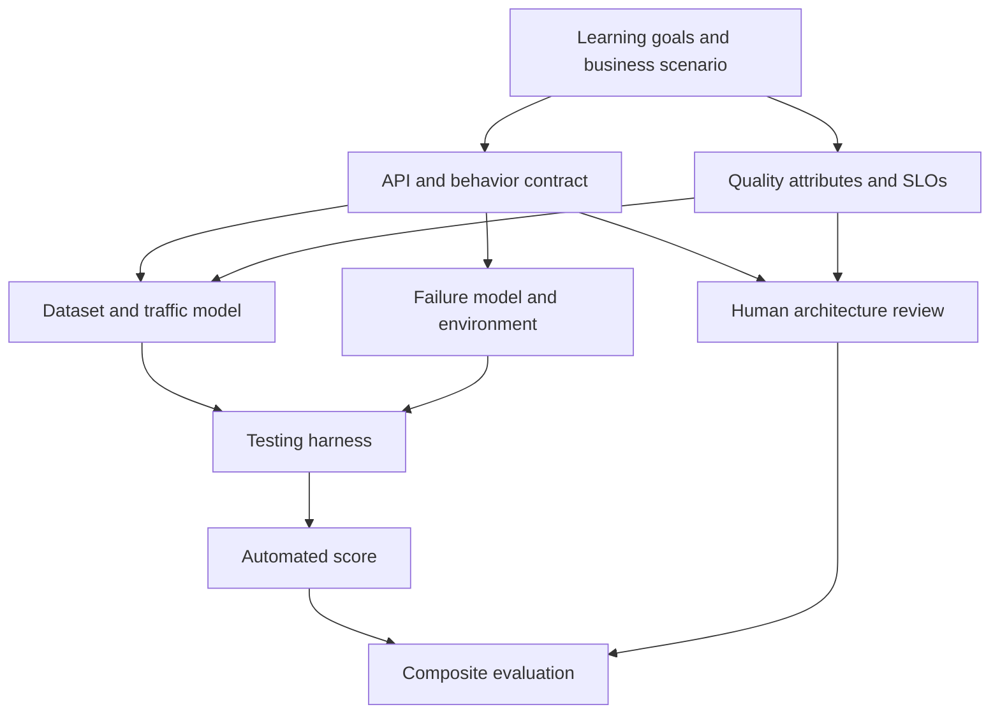
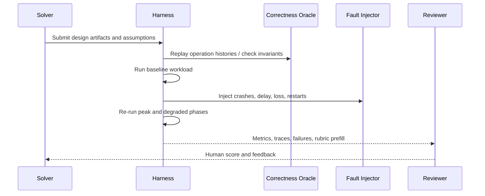
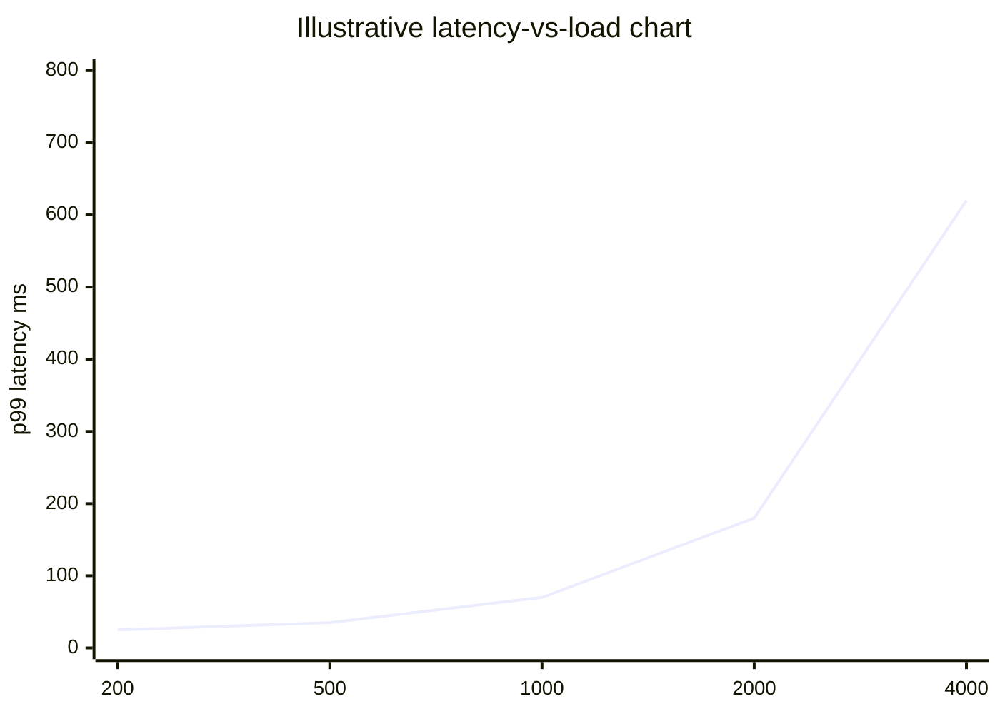
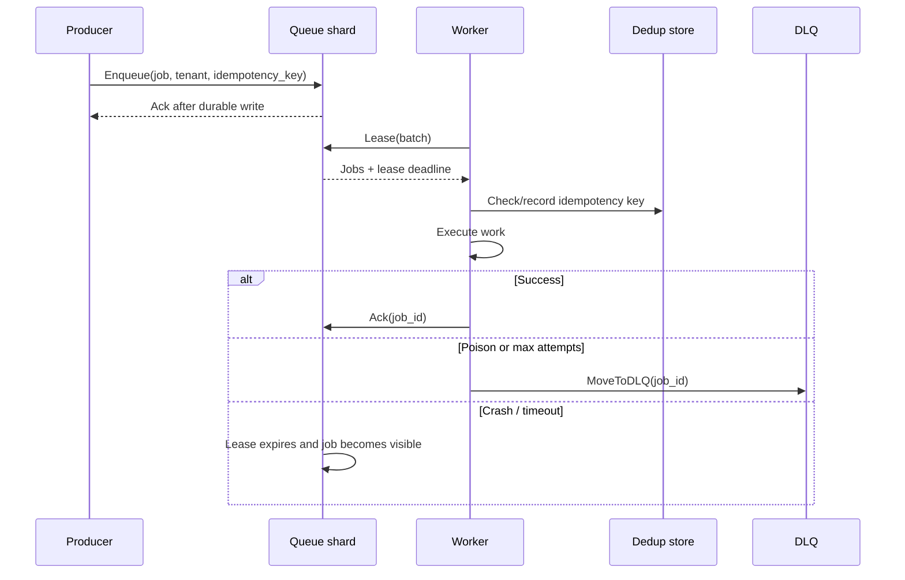

# Designing Rigorous Language-Agnostic Systems-Design Exercises for Agent Generation

## Executive Summary

A good problem specification for a systems-design exercise is not mainly an API schema, a CRUD story, or a bundle of JSON fields. It is a structured description of **quality attributes, behavioral guarantees, workload shape, operating environment, and scoring logic**. The strongest evidence base for this comes from scenario-based architecture evaluation at SEI, which treats availability, performance, security, modifiability, and related qualities as first-class evaluation targets, and from correctness-oriented distributed-systems practice, which emphasizes explicit invariants, consistency semantics, and fault models rather than informal endpoint descriptions alone. citeturn36view0turn36view2turn36view5turn17search12turn33view9

For an agent that generates exercises, the specification should therefore require five things in every exercise: **clear learning objectives**, **a protocol and behavior contract**, **a benchmarkable workload model**, **realistic constraints and failures**, and **an evaluation harness with both automated and human scoring**. This recommendation is strongly supported by MIT’s distributed-systems lab progression from single-machine correctness to replication and sharding, by Google SRE’s emphasis on SLOs and overload handling, and by repeatable benchmark design in YCSB, TPC, LinkBench, and TAOBench. citeturn9view0turn10view0turn11view0turn11view1turn11view2turn11view3turn35view7turn35view8turn35view9turn21view1turn21view2turn32search10turn23view0turn24search1

The most practical authoring stack is a **hybrid**. Use **JSON** as the canonical exchange format because it is ubiquitous and easy for agents and harnesses to manipulate; validate it with **JSON Schema** or **CUE**; and optionally compile or mirror it into **Protocol Buffers** when strongly typed inter-service exchange or versioned binary transport matters. Represent behavioral guarantees separately as **state-machine transitions, invariants, and consistency/failure clauses**, with optional TLA+ overlays for higher-assurance exercises. citeturn34view1turn34view0turn34view2turn3search10turn17search1turn17search12turn35view6

A robust scoring model should weight **semantic correctness and invariants** most heavily, then **performance/SLO achievement**, **resilience under failure**, **trade-off quality**, and finally **communication quality**. Progressive reveal should begin with a strongly scaffolded base spec and then release workload traces, failures, and optimization pressure in stages, because novices benefit from worked examples and embedded scaffolds, while more advanced learners benefit from gradually reduced guidance and more open-ended design space. citeturn34view5turn34view6turn29view0turn30view0

The source priority for such a system should be: **official standards and documentation first**, then **seminal papers**, then **high-signal engineering practice**. In concrete terms, prioritize SEI, Google SRE and Research, AWS Well-Architected and Builders’ Library, Microsoft Learn and Cosmos DB consistency materials, TPC, Lamport’s TLA+ materials, FoundationDB testing docs, MIT 6.5840 labs, and major ACM/USENIX papers such as MapReduce, Bigtable, Dynamo, CAP, linearizability, Raft, and The Tail at Scale. citeturn36view2turn19search2turn35view5turn35view6turn21view3turn17search1turn34view3turn9view0turn37search9turn33view1turn33view0turn33view8turn33view9turn33view7turn12search5

## Design Principles from the Literature

The literature points to a simple design rule: every exercise should be driven by **architecture-critical scenarios**, not by component inventories alone. SEI’s Quality Attribute Workshop identifies architecture-critical qualities from business or mission goals, and SEI’s “general scenarios” work explicitly treats scenarios as templates for generating concrete quality-attribute requirements. ATAM then evaluates how architectural decisions satisfy those goals and where trade-offs appear. This is exactly the right mental model for exercise generation: the spec should ask the agent to produce a scenario with measurable quality goals and visible trade-offs, not merely a list of services. citeturn36view3turn36view0turn36view2turn36view1

Correctness needs the same treatment. Semantics such as **linearizability**, **at-most-once behavior**, **replicated-log safety**, and **consistency level choices** should be explicit in the problem statement because they materially change acceptable designs. Linearizability gives the “single instant between invocation and response” mental model for concurrent operations. Raft provides a tractable replicated-log model and was explicitly designed to be easier to understand than Paxos. AWS’s formal-methods experience and Azure Cosmos DB’s published TLA+-anchored consistency semantics both show that system behavior becomes much more reviewable when invariants and state transitions are written down precisely. citeturn33view9turn33view7turn17search12turn17search1turn35view6

Difficulty should progress in a way that matches both distributed-systems curricula and instructional evidence. MIT 6.5840 moves from MapReduce-style coordination to a single-machine linearizable key-value server, then to Raft, then a fault-tolerant key-value service, and finally to a sharded key-value service with reconfiguration. A 2025 distributed-systems education paper reports that embedded scaffolds, explicit coding and experimental milestones, and gradually reduced guidance improve performance in hands-on distributed-systems labs. The worked-example literature likewise shows that novices learn more efficiently when guidance reduces search burden before independent problem solving fully takes over. citeturn10view0turn11view0turn11view1turn11view2turn11view3turn29view0turn30view0

Realistic exercises also need realistic traffic, data, and failure pressure. YCSB exists because cloud-serving systems require apples-to-apples workload comparison across read-heavy, write-heavy, and scan-heavy mixes. TPC-C and TPC-DS standardize OLTP and decision-support workloads with meaningful transaction/query structure. LinkBench and TAOBench add power-law skew, social-graph structure, range scans, and end-to-end transactional request patterns that are hard to capture with toy benchmarks. Google’s Tail at Scale, CAP, Cosmos DB’s consistency trade-offs, and AWS overload/isolation guidance show why exercises should force learners to confront latency tails, partitions, degraded modes, and blast-radius reduction. citeturn21view1turn21view2turn32search10turn23view0turn24search1turn12search5turn33view8turn35view6turn35view9turn35view10turn35view2turn35view4

The table below synthesizes that evidence into a practical progression for exercise generation. It combines MIT’s lab sequence, SEI’s scenario-based architecture evaluation, and educational scaffolding results into four tiers that an exercise-generation agent can target. citeturn9view0turn11view0turn11view1turn11view2turn11view3turn36view0turn36view2turn29view0turn30view0

| Difficulty tier | Typical environment                                          | Learning objectives and concepts                                                                                                                 | Representative example problems                                                  |
| --------------- | ------------------------------------------------------------ | ------------------------------------------------------------------------------------------------------------------------------------------------ | -------------------------------------------------------------------------------- |
| Foundation      | Single node, one process or one host                         | API semantics, state machines, idempotency, at-most-once behavior, linearizability, local durability, basic capacity and observability reasoning | Linearizable KV + lock service; metadata index with crash recovery               |
| Intermediate    | Coordinator + workers, or 3-node replicated cluster          | Task scheduling, leases, retries, timeouts, visibility windows, failure detection, backpressure, degraded behavior                               | Durable job queue; MapReduce coordinator; cache-backed task dispatcher           |
| Advanced        | 3–9 nodes, sharded or replicated partitions                  | Consensus-backed replication, quorums, sharding, hot-key mitigation, tail-latency management, SLO-aware trade-offs                               | Fault-tolerant KV service; sharded rate limiter; multi-tenant feed fan-out       |
| Expert          | Multi-shard and/or multi-region, reconfiguration during load | Dynamic shard movement, workload isolation, multi-region consistency, migration safety, fault injection, formal invariants, blast-radius control | Reconfigurable sharded KV; social graph edge store; geo-replicated control plane |

This tiering should not be treated as merely “more scale.” It is a progression from **local semantics** to **distributed agreement** to **distribution under skew** to **change under failure**. That mirrors how Bigtable and Dynamo expose different partitioning and consistency choices, how Raft structures replicated state, and how social-graph benchmarks reveal hot-spot behavior that small uniform workloads hide. citeturn33view1turn33view0turn33view7turn23view0turn24search1

## Canonical Problem Specification

The core recommendation is to require a **canonical exercise specification** with modular sections that can be rendered for humans, validated mechanically, and executed by a harness. The spec should contain at least: a problem brief, learning objectives, explicit operations and protocol semantics, behavioral invariants, workload and dataset generators, environment and deployment constraints, non-goals, deliverables, hints/reveal schedule, and a scoring model. This structure aligns with SEI’s quality-attribute scenario templates, with formal specification practice for distributed systems, and with benchmark design that separates workload description from system under test. citeturn36view0turn36view3turn17search12turn17search1turn21view1turn21view2turn32search10



A strong specification should make the following modules mandatory.

| Module                      | Must include                                                                                                               | Why it matters                                                                             |
| --------------------------- | -------------------------------------------------------------------------------------------------------------------------- | ------------------------------------------------------------------------------------------ |
| Scenario and scope          | user story, system boundary, success definition, explicit non-goals                                                        | Prevents shallow “design everything” responses and forces problem framing                  |
| Learning objectives         | 3–6 targeted skills, prerequisite concepts, tier                                                                           | Lets the agent generate the right complexity and lets the grader score the intended skills |
| Protocol/operation contract | operations, request/response shapes, ordering expectations, retry semantics, idempotency keys, pagination or leasing rules | Makes the exercise language-agnostic while still precise about behavior                    |
| Behavioral semantics        | invariants, consistency model, failure model, durability expectations, clock/network assumptions                           | Prevents hand-wavy answers and enables correctness review                                  |
| Workload model              | dataset size, access distribution, hot-set skew, read/write/scan mix, burst profile, multi-tenant mix, replay traces       | Forces real capacity and partitioning decisions                                            |
| Environment                 | CPU/memory/storage/network budgets, topology, allowed services, scaling stages                                             | Keeps design choices comparable across candidates                                          |
| Deliverables                | architecture diagram, sequence diagram, data/partitioning plan, capacity model, trade-off memo, incident/failure analysis  | Evaluates design thinking, not implementation trivia                                       |
| Evaluation                  | automated thresholds, correctness checks, human rubric, penalties, hint policy                                             | Makes scoring repeatable and auditable                                                     |

The **behavioral semantics** section is the difference between a design exercise and “surface-level JSON munging.” It should ask for invariants such as “an acknowledged enqueue is never lost,” “at most one shard group serves a shard at one epoch,” or “a successful Put is visible to subsequent non-concurrent Gets.” This follows the same logic behind linearizability, consensus protocols, and TLA+-style design reviews: if the behavior cannot be stated precisely, it is difficult to evaluate architecture choices rigorously. citeturn33view9turn33view7turn17search12turn35view6

The **workload model** should never be a single QPS scalar. Instead, the spec should require a distribution, because real systems are shaped by skew and bursts: YCSB differentiates read-heavy, write-heavy, and scan-heavy mixes; TPC-C standardizes concurrent transaction mixes; TPC-DS captures large decision-support workloads; LinkBench models power-law graph structure and hot/warm/cold access; and TAOBench provides production-derived end-to-end social request patterns. citeturn21view1turn21view2turn32search10turn23view0turn24search1

The visual artifact requirements should be explicit. In practice, the best minimum set is: a **context/component architecture diagram**, a **critical-path sequence diagram**, a **deployment or partitioning diagram**, and a short **risk/trade-off register**. Scenario-driven architecture methods work because they make quality affects inspectable, and sequence/state-style artifacts make semantic disputes and bottlenecks visible earlier. citeturn36view2turn36view4turn17search1

## Agent Input and Output Schemas

The format choice should follow function, not fashion. **JSON** is the best default interchange format because JSON Schema is specifically intended for validation, documentation, hyperlink navigation, and interaction control of JSON data. **Protocol Buffers** are strongest when the spec or generated exercise needs versioned, typed transport and backwards/forwards compatible message evolution. **CUE** is particularly attractive as a constraint language because it lets data, schema, and policy constraints coexist and can validate JSON and YAML. citeturn34view1turn34view0turn34view2turn3search10

The comparison below is the practical trade-off table I would hand to the agent-platform designer.

| Option             | Strengths                                                                                                     | Weaknesses                                                                                                            | Best use                                                                  |
| ------------------ | ------------------------------------------------------------------------------------------------------------- | --------------------------------------------------------------------------------------------------------------------- | ------------------------------------------------------------------------- |
| JSON + JSON Schema | Best interoperability; trivial for agents and harnesses; easy diffing and storage; strong validator ecosystem | Verbose; weak for cross-field semantic constraints unless extended; behavior still needs a separate invariant block   | Canonical authoring and interchange format                                |
| Protobuf           | Strong typing; compact transport; versioning discipline; better for long-lived internal APIs                  | Less human-readable; weaker for ad hoc editing and prompt authoring; awkward for rich text and nested policy comments | Internal service-to-service exchange, cached compiled form                |
| DSL via CUE        | Excellent for constraints, reuse, and policy overlays; validates multiple data formats; concise               | Higher learning curve; smaller ecosystem than JSON; may need translation layer for some agent stacks                  | Validation overlay, configuration policy, complex cross-field constraints |

For most teams, the highest-leverage pattern is: **author canonical exercise specs in JSON**, **validate with JSON Schema or CUE**, and **optionally emit Protobuf mirrors** for transport-heavy systems. Put protocol behavior in fields like `consistency_model`, `invariants`, `history_oracle`, and `failure_schedule`; do not hide behavior inside prose. This mirrors how modern cloud guidance separates operational objectives, architecture decisions, and consistency semantics, and it is consistent with formal-methods practice at AWS and Microsoft. citeturn34view1turn34view2turn17search12turn35view6

A generator prompt template can be short if the schema is strong. This is a workable template:

```text
You are generating one language-agnostic systems-design exercise.

Output exactly one ExerciseSpec object.
The exercise must target tier: {{tier}}
Primary skill cluster: {{skill_cluster}}
Secondary skill cluster: {{secondary_skill_cluster}}

Hard requirements:
- Do not generate CRUD-style JSON transformation tasks.
- Include explicit quality attributes and measurable SLOs.
- Include protocol/behavior clauses: invariants, consistency model, retry/idempotency semantics, and failure model.
- Include a realistic workload generator with size, distribution, and skew.
- Include realistic infrastructure constraints and non-trivial trade-offs.
- Include deliverables: architecture diagram, critical-path sequence diagram, capacity model, trade-off memo.
- Include automated evaluation thresholds and human review criteria.
- Include hints with progressive reveal stages.
- Keep the exercise language-agnostic and platform-agnostic unless platform is explicitly specified.

Prefer official and seminal patterns from distributed systems literature and high-signal engineering practice.
```

A minimal machine-consumable exercise template instance can look like this:

```json
{
  "meta": {
    "id": "exercise_id",
    "title": "Short title",
    "tier": "foundation|intermediate|advanced|expert",
    "timebox_minutes": 90,
    "summary": "One-sentence problem brief"
  },
  "learning_objectives": [
    "state-machine semantics",
    "capacity planning",
    "fault tolerance"
  ],
  "scenario": {
    "context": "User/business story",
    "non_goals": ["Out of scope item"]
  },
  "system_contract": {
    "operations": [
      {
        "name": "OperationName",
        "request": { "fields": [] },
        "response": { "fields": [] },
        "notes": "Ordering, idempotency, pagination, leasing, etc."
      }
    ],
    "sla": {
      "availability": "99.9%",
      "latency_p99_ms": 200
    }
  },
  "behavior": {
    "consistency_model": "linearizable|session|eventual|custom",
    "invariants": ["Invariant sentence"],
    "failure_model": ["node crash", "network delay", "partition", "clock skew"],
    "durability": "What acknowledgement means"
  },
  "workload": {
    "dataset": {
      "entities": "What exists",
      "initial_scale": "e.g. 10M keys"
    },
    "traffic": {
      "baseline_rps": 1000,
      "peak_multiplier": 10,
      "mix": { "reads": 0.8, "writes": 0.2 },
      "distribution": "uniform|zipf|pareto|trace-replay",
      "hotset_fraction": 0.01
    }
  },
  "environment": {
    "topology": "single-node|replicated|sharded|multi-region",
    "resources": {
      "cpu": "budget",
      "memory_gb": 16,
      "storage": "budget",
      "network": "latency/bandwidth assumptions"
    }
  },
  "deliverables": [
    "architecture_diagram",
    "sequence_diagram",
    "capacity_model",
    "tradeoff_memo"
  ],
  "evaluation": {
    "automated": {
      "correctness_oracle": "history|invariant|golden-output",
      "thresholds": ["p99<200ms", "error_rate<1%"]
    },
    "human": {
      "dimensions": [
        "correctness",
        "tradeoff_quality",
        "operability",
        "communication"
      ]
    }
  },
  "hints": {
    "reveal_stages": [
      "base clarifications",
      "workload trace",
      "failure scenario",
      "optimization hint"
    ]
  }
}
```

If the team wants stronger cross-field validation, a CUE overlay is often the cleanest companion schema because it can validate the JSON form while enforcing tier and workload relationships more precisely. That approach is especially useful for rules like “expert-tier exercises must include reconfiguration or multi-region semantics” or “every exercise with eventual consistency must define a stale-read budget.” citeturn34view2turn3search1turn3search10

## Evaluation Harnesses, Scoring, and Progressive Reveal

The harness should combine **correctness checks**, **performance/load checks**, **fault injection**, and **human architecture review**. k6 provides explicit pass/fail thresholds and request-content checks, AWS FIS provides managed chaos experiments and emphasizes planning and staged rollout, Linux `tc netem` injects delay/loss/corruption for protocol testing, Jepsen centers safety properties and distributed-system faults, and FoundationDB’s deterministic simulation shows the value of perfectly repeatable runs when debugging subtle distributed failures. citeturn34view5turn34view6turn35view0turn35view1turn34view7turn15search6turn15search17turn34view3

A practical scoring rubric is below. I recommend keeping the weights stable across exercises so that learners can compare progress over time.

| Dimension                | Automated evidence                                                                      | Human evidence                                                   | Suggested weight |
| ------------------------ | --------------------------------------------------------------------------------------- | ---------------------------------------------------------------- | ---------------- |
| Semantic correctness     | invariant checks, history replay, expected outputs, stale-read or duplicate-rate bounds | correctness of guarantees stated and defended                    | 35%              |
| Performance and capacity | p50/p95/p99 latency, throughput, queue depth, consumer lag, storage growth              | realism of capacity model and bottleneck analysis                | 20%              |
| Resilience               | crash/partition/restart results, recovery time, degraded mode behavior                  | failure-mode coverage, blast-radius reasoning                    | 15%              |
| Trade-off quality        | threshold pass/fail under conflicting constraints                                       | quality of choices around consistency, cost, latency, complexity | 15%              |
| Operability              | alert thresholds, metric coverage, incident affordances                                 | observability, runbook readiness, rollback/change strategy       | 10%              |
| Communication quality    | n/a or lightweight format checks                                                        | clarity of diagrams, assumptions, and decision records           | 5%               |

This rubric is intentionally asymmetric. Architecture evaluation methods and formal-correctness practice both imply that a beautifully explained but behaviorally wrong design should not score well; semantic and quality-attribute correctness must dominate. At the same time, SLOs and overload handling should be visible in the scoring because real systems are judged by user experience, not just by internal elegance. citeturn36view2turn36view4turn33view9turn35view7turn35view8turn35view9

The review loop should also be staged.



For progressive reveal, the best pattern is: **base scenario**, then **benchmark trace**, then **fault schedule**, then **cost or policy pressure**, then **design defense**. That structure is consistent with the educational evidence for embedded scaffolds, checkpoints, and gradually reduced guidance, and with the worked-example effect for novices. Early tiers should reveal more structure up front; expert tiers should reveal less and leave more design-space ambiguity. citeturn29view0turn30view0

The harness should export a fixed set of performance charts for every exercise so that learners compare designs apples-to-apples. The highest-value charts are: **request rate vs p99 latency**, **success/error rate over time**, **queue depth or lag over time**, **per-shard QPS or storage imbalance**, **failover or recovery timeline**, and **error-budget burn rate**. Those visualizations are justified by Tail at Scale, Google SRE’s SLO/alerting guidance, and real consistency/latency trade-offs in globally distributed databases. citeturn12search5turn35view7turn35view8turn35view6



## Example Exercise Portfolio

The portfolio below is designed to span semantic correctness, replication, overload, skew, and reconfiguration. It mirrors the progression seen in MIT’s lab sequence and benchmark-driven industry practice: start with local semantics, then delivery/failure behavior, then reconfiguration and skew-heavy workloads. citeturn11view0turn11view1turn11view2turn11view3turn21view1turn23view0turn24search1

**Linearizable KV and lock service**

**Spec.** Design a single-node service supporting `Get`, `Put`, `CompareAndSet`, `AcquireLock`, and `ReleaseLock`. The learner must guarantee linearizable behavior for non-concurrent operations and a valid linearizable history for concurrent ones; successful writes must survive crash/restart; lock re-acquisition must handle client retry and stale ownership. The workload should be 100,000 keys, 90/10 read/write mix, plus a hot set of 500 keys and 100 contended locks with lease expiry. Environment: one host, bounded RAM, local SSD, no external coordination service. Deliverables: API contract, write path, recovery path, lock expiry semantics, and observability plan. The intended skills are state-machine modeling, local durability, idempotency, and basic capacity reasoning. citeturn11view0turn33view9

**Expected design sketch.** A strong sketch typically includes an append-only write-ahead log, an in-memory index or version table, compare-and-set or versioned writes for lock ownership, explicit lease semantics, and a replay procedure that reconstructs state after restart. A weak sketch usually omits retry semantics or conflates lease timeout with safe release. citeturn11view0turn33view9

**Sample evaluation.** Full credit requires a believable linearization story and crash recovery path. Deduct heavily if the design allows duplicate `Put` effects on client retry, stale lock release, or ambiguous crash acknowledgment semantics. citeturn11view0turn33view9

**Tenant-isolated durable job queue**

**Spec.** Design a durable queue with `Enqueue`, `Lease`, `Ack`, `Nack`, `Requeue`, and `MoveToDLQ`. Acknowledged jobs must not be lost; leased jobs may be retried after lease expiry; delivery may be at-least-once, but duplicate processing must be measurable and bounded by idempotency design. The queue is multi-tenant. Baseline load is 5,000 jobs/s, but 1% of tenants can burst 20× above baseline. About 1% of jobs are poison messages. The system should continue operating through node crashes, broker restarts, delayed visibility updates, and network delay/loss. The non-trivial design pressure is fairness and backlog isolation: one tenant must not bury the fleet. This exercise targets leases, retries, idempotency, dead-letter handling, fairness, overload behavior, and workload isolation. citeturn35view3turn35view2turn35view4turn35view9turn35view10

**Expected design sketch.** A strong design usually partitions work across a fixed shard set, maps each tenant onto a small virtual shard subset, uses append-only durable storage for enqueue, tracks leases and visibility timeouts, and records deduplication or idempotency tokens outside ephemeral worker memory. It should also define a clear DLQ policy and consumer backpressure behavior. citeturn35view3turn35view2turn35view4

**Fully worked exercise template**

The following is a concrete, agent-consumable instance for this exercise.

```json
{
  "meta": {
    "id": "tenant_isolated_job_queue_v1",
    "title": "Design a tenant-isolated durable job queue",
    "tier": "intermediate",
    "timebox_minutes": 120,
    "summary": "Design a multi-tenant durable queue that isolates bursty tenants, tolerates crashes, and exposes measurable delivery semantics."
  },
  "learning_objectives": [
    "delivery semantics and leases",
    "backpressure and overload handling",
    "tenant isolation and shard selection",
    "durability and replay",
    "operability and SLO-driven scoring"
  ],
  "scenario": {
    "context": "A platform team needs a background-work queue for webhook delivery, image processing, and account notifications.",
    "non_goals": [
      "exactly-once end-to-end execution",
      "arbitrary query language over queued jobs",
      "cross-tenant ordering guarantees"
    ]
  },
  "system_contract": {
    "operations": [
      {
        "name": "Enqueue",
        "notes": "Returns job_id after durable acceptance."
      },
      { "name": "Lease", "notes": "Returns visible jobs and lease deadline." },
      { "name": "Ack", "notes": "Marks a leased job completed." },
      { "name": "Nack", "notes": "Requests early retry." },
      {
        "name": "MoveToDLQ",
        "notes": "Triggered after bounded attempts or poison classification."
      }
    ],
    "sla": {
      "availability": "99.9%",
      "latency_p99_ms": 250,
      "durable_enqueue_ack": "Ack means job survives node restart"
    }
  },
  "behavior": {
    "consistency_model": "per-job durability, at-least-once delivery",
    "invariants": [
      "A durable Enqueue is never silently lost.",
      "A leased job is not concurrently leased twice unless lease bookkeeping is lost and later corrected by retry semantics documented by the design.",
      "A job moved to DLQ is not returned to the main queue without an explicit re-drive action."
    ],
    "failure_model": [
      "single-node crash",
      "broker restart",
      "consumer crash mid-processing",
      "network delay",
      "temporary partition between broker and consumers"
    ],
    "durability": "Durable acceptance requires fsync-equivalent persistence or replicated commit, depending on the chosen design."
  },
  "workload": {
    "dataset": {
      "tenants": 50000,
      "job_payload_mode": "metadata in queue, large payloads via object references"
    },
    "traffic": {
      "baseline_jobs_per_sec": 5000,
      "peak_multiplier": 20,
      "distribution": "zipf",
      "hot_tenant_fraction": 0.01,
      "poison_job_fraction": 0.01
    }
  },
  "environment": {
    "topology": "3 logical queue nodes plus stateless consumers",
    "resources": {
      "memory_gb_per_node": 16,
      "storage": "local SSD",
      "network": "intra-cluster RTT 1-3ms with injectible delay/loss"
    }
  },
  "deliverables": [
    "component architecture diagram",
    "lease lifecycle sequence diagram",
    "storage and replay design",
    "backpressure and fairness policy",
    "capacity model",
    "failure-mode analysis"
  ],
  "evaluation": {
    "automated": {
      "correctness_oracle": "history and invariant replay",
      "thresholds": [
        "enqueue_p99_ms < 250",
        "silent_loss_rate = 0",
        "duplicate_delivery_rate documented and within declared bound",
        "hot_tenant spillover limited to declared shard subset"
      ]
    },
    "human": {
      "dimensions": [
        "correctness of delivery semantics",
        "fairness and tenant isolation",
        "clarity of retry/idempotency story",
        "operability and observability",
        "trade-off reasoning"
      ]
    }
  },
  "hints": {
    "reveal_stages": [
      "Clarify that exactly-once worker side-effects are out of scope.",
      "Reveal that one tenant can burst 20x and starve common shards.",
      "Reveal delayed visibility update and consumer crash scenario.",
      "Reveal cost cap that discourages a queue-per-tenant design."
    ]
  }
}
```

A high-quality sample solution outline would normally include: a durable append log or replicated log for `Enqueue`; fixed physical shards with **virtual tenant-to-shard assignment** to avoid queue-per-tenant explosion; **shuffle-shard-style tenant isolation** or similar blast-radius reduction; lease records with expiry and deduplication keys; bounded re-drive policy to DLQ; consumer-side idempotency contract; and metrics for enqueue latency, lease wait time, redelivery rate, per-tenant lag, shard imbalance, and DLQ growth. The key trade-off discussion should compare simpler shared-queue designs against fairness and correlated-failure risk, and should explicitly justify why the design chooses at-least-once instead of pretending exactly-once exists everywhere. citeturn35view2turn35view3turn35view4turn35view9turn35view10



**Sample evaluation.** An example “strong but not perfect” submission might score 88/100: 32/35 for correctness because the lease and DLQ invariants are clear; 16/20 for performance because shard hot-spot analysis is plausible but tail latency under recovery is underdeveloped; 14/15 for resilience because worker crash and broker restart handling are solid; 13/15 for trade-offs because queue-per-tenant is correctly rejected in favor of virtual shards; 9/10 for operability; and 4/5 for communication. A weak submission would score poorly if it uses one global queue without tenant isolation or fails to define what an enqueue acknowledgment means. citeturn35view2turn35view3turn34view5turn34view6

**Reconfigurable sharded KV service**

**Spec.** Design a key-value service that shards keys across replicated groups. Support `Get`, `Put`, and `ChangeConfigTo`-style reconfiguration. Guarantee that at most one group serves a shard at a given configuration epoch, and that reconfiguration can complete after controller failure or partition. Workload: 100 million keys, Zipfian access on 1% of keys, plus rebalance events that move 5% of shards while reads/writes continue. Environment: 3 shard groups, 3 replicas each, consensus inside each group. This exercise targets shard migration safety, epoch management, replication, and service continuity under change. citeturn11view3turn11view2turn33view7turn33view9

**Expected design sketch.** A strong sketch usually includes per-group replicated state, versioned configurations, a freeze/copy/install/cutover/delete migration protocol, and a convincing argument that double-serving cannot occur even if the controller dies mid-move. Submissions that pause the whole system for every migration can still pass correctness but should lose availability/performance points. citeturn11view3turn11view2

**Sample evaluation.** Score highly when the answer explicitly separates configuration epochs from data ownership and defines safe retry/replay for migration RPCs. Deduct heavily if clients can race between old and new owners without an epoch discipline. citeturn11view3turn33view9

**Social graph edge store under skew**

**Spec.** Design a graph-serving store for objects and associations such as posts, comments, likes, and follows. The workload is read-dominated but includes edge range scans and a small fraction of writes; the out-degree distribution is power-law, hot rows exist, and some scans hit extremely high-degree nodes. Use production-inspired synthetic data rather than toy uniform keys. A realistic scaled-down harness can model tens to hundreds of millions of edges, with separate mixes for point reads, edge scans, and writes. This exercise targets skew-aware partitioning, cache architecture, tail latency, hot-node isolation, scan pagination, and observability. citeturn23view0turn24search1turn12search5

**Expected design sketch.** Strong sketches typically partition by edge/object type or ownership domain, treat hot high-degree nodes specially, use cache and storage tiers consciously, and explain how range scans and write amplification affect tail latency. Answers that assume uniform keys, ignore hot-node scans, or treat “graph database” as a magic box should score poorly. citeturn23view0turn24search1turn12search5

**Sample evaluation.** Award points when the learner recognizes that read misses, edge scans, and high-degree nodes shape the whole architecture. Deduct for designs that cannot explain cache invalidation, per-partition imbalance, or what happens to p99 when a celebrity node becomes hot. citeturn23view0turn12search5

## Open Questions and Limitations

There is no single official standard for “systems-design exercises” analogous to a TPC benchmark or a language specification. The framework above is therefore a synthesis from adjacent bodies of evidence: architecture evaluation, distributed-systems pedagogy, benchmark design, SRE practice, and correctness-oriented specification. That synthesis is high-confidence, but it is still a synthesis rather than a single canonical standard. citeturn36view2turn29view0turn21view3turn19search2

Some cited operational guidance is cloud-provider-specific. The recommendations in this report abstract the underlying principles—quality-attribute scenarios, precise semantics, distribution-aware workloads, replayable tests, SLO-driven scoring, and staged fault pressure—so that the resulting exercise specifications remain language-agnostic and platform-agnostic unless a specific environment is intentionally part of the exercise. citeturn35view5turn34view9turn34view8turn35view6

The education evidence is strongest for **scaffolding and progression**, not for one exact rubric weight vector. The scoring weights proposed here are therefore a practical recommendation grounded in architecture evaluation and SLO-driven operations, but teams should tune them after observing real learner submissions and failure modes. citeturn29view0turn30view0turn36view2turn35view7
